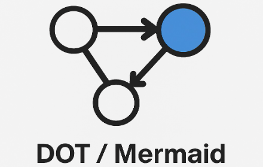

# DOT / mermaid viewer

## Overview
This is a graph drawing and visualization tool that supports both DOT language and Mermaid syntax. With this Chrome extension, you can easily create, view, and edit various types of diagrams such as flowcharts, sequence diagrams, and Gantt charts.

### Install
Chrome Web Store by google.com  
[https://chromewebstore.google.com/detail/dotmermaid-viewer/lbklenconfcjcdfcigmfhhmlnnlliabc](https://chromewebstore.google.com/detail/dotmermaid-viewer/lbklenconfcjcdfcigmfhhmlnnlliabc)

## Features
- Support for both DOT language and Mermaid syntax
- Quick diagram creation using templates
- Download diagrams in PNG or SVG format
- Copy, paste, and clear code functionality
- Full-screen display mode

## How to Use
1. After installing the extension, click on the icon in the Chrome toolbar to launch it.
2. Select the syntax (DOT or Mermaid).
3. Choose a template or directly input your code.
4. The graph will be automatically rendered based on your input.
5. If needed, use the download button to save the graph in PNG or SVG format.

## Technical Details
- External libraries:
    - [Viz.js](https://github.com/mdaines/viz-js): Used for rendering DOT language
    - [Mermaid.js](https://mermaid.js.org/): Used for rendering Mermaid syntax. ver 11.6.0

## Privacy Policy

### Data Collection and Usage
- **Local Processing**: This extension processes all data locally on your device. Your input code, diagrams, and other content are never sent to external servers.
- **No Data Storage**: We do not store any of your data persistently. All data is temporary and exists only within your current browser session.
- **Clipboard Access**: The extension requests clipboard access permissions solely to provide copy and paste functionality for your convenience. We do not read from or write to your clipboard without your explicit action.
- **Display Information**: We access display information only to properly size and position the application window. This information is not collected or stored.

### Third-Party Services
This extension does not integrate with or send data to any third-party services or analytics platforms.

### Updates to Privacy Policy
If we make material changes to this privacy policy, we will notify you through an extension update and/or a notice in the extension interface.

### Contact
If you have any questions or concerns about this privacy policy or our data practices, please submit an issue through our repository.
